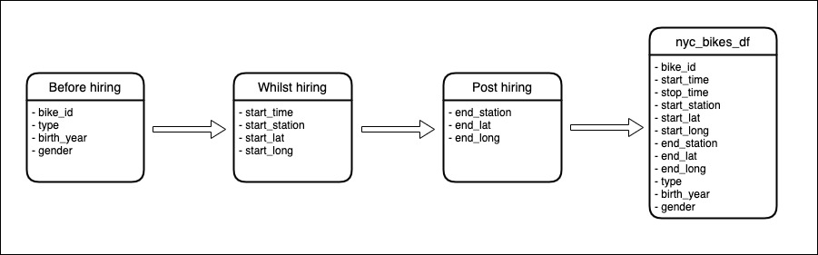

```{r setup, include=FALSE}
knitr::opts_chunk$set(echo = FALSE, message = FALSE)
```

### Domain knowledge (1.1)

NYC Citi Bikes is the largest bike share system in the United States with hundreds of stations across Manhattan, Brooklyn, Queens and Jersey City. They have thousands of bikes which are sturdy and durable that can be locked into different stations throughout the city 24 hours a day, 365 days a year. 

Citi Bikes have become an integral part of NYC’s transportation network with riders using the bikes to commute, explore the city or run errands. Since May 2013 when they launched they have celebrated many milestones including 100,000 trips in a single day, 100 million overall trips, 20,000 bikes and over 1,300 stations.

This particular data set is a sample from 10 NYC Citi Bikes throughout 2018. The data set is made up of the following:

* Bike id
* Start time of the trip
* Stop time of the trip
* Start station
* Start latitude
* Start longitude
* End station
* End latitude
* End longitude
* Type - customer or subscriber
* Birth year
* Gender

### Business requirements (1.2)

In this report I will look at the data set of 10 Citi Bikes in the NYC area in 2018. I will start by reviewing the data set for any cleaning and wrangling that will allow me to better visualise the data. 

I will then create various graphs using the ggplot package to display different trends based off the wrangled data. Following that I will use the leaflet package to create a geographical spread of some of the data followed by a conclusion from the data.

### Business processes and data flow (1.3)

I created this data flow to show the breakdown of how the data is gathered to create the nyc_bikes_df. This shows the breakdown into 'Before hiring', 'Whilst hiring' and 'Post hiring'

```{r}

```

### Data visualisation as a tool for decision-making (1.4)

This report will give NYC Citi Bikes an insight into their users' ages as well as gender, most preferred station, busiest day of the week/month, busiest quarter etc.

NYC Citi Bikes can then use this data to make better data-driven business decisions to do the following:

* Tailor their advertising to attract more users in their most popular age group OR age groups where they have fewer riders
* See when they can make key repairs to bikes/stations if they have less frequent users at certain times of the year
* Add or reduce the number of bikes at certain stations depending on popularity of the position

### Data types (1.5)

There are a few different types of variables in the data:

* Datetime for start_time and end_time
* Factor for bike_id, start_station, end_station, type and gender
* Numeric for start_lat, start_long, end_lat, end_long, birth_year

Additionally all of the mutated columns I added are numeric (age, month, week_day, quarter)

### Data quality and data bias (1.6)

When using a data set there is always concern about ethics and bias. In this particular data set the user's data is anonymous in that there are at least 3-5 individuals to whom the information could refer - there is simply the gender and birth year to identify users. That being said there could be bias within this data collection for instance with gender and age bias depending on NYC Citi Bikes approach to attracting new customers if they are targeting Male office workers for example which will lead to a bias data set.  

NYC Citi Bikes ask users for consent on signing up to both store data and see the start and end locations of their rides thus there are few data ethics concerns with collecting this data.

The quality of the data is always a concern as it may be collected for one purpose and then sold to another company/third party to be used for another purpose. This particular data was collected directly from NYC Citi Bikes so there is little concern for the 

### Preparing data for visualisation (1.7)

I began cleaning the data by reviewing the data set to see if there were any data entry errors that would alter the data set. I noticed in birth year that there were 2 entries for 1887 and 1888 which I removed as that data does not align with the entries. I then checked for any NA entries in the data set but it came back 0 so I determined the data was clean and ready for analysing.

For data wrangling I mutated the start time column  to create a separate month/day/weekday/quarter column so the data could be visualised in more specific groups. I also created a column called age which took away 2018 (year of data collection) from the birth year as I thought the age of the user would be a preferable visualisation than birth year of the user.  

```{r}
library(tsibbledata)
library(tsibble)
library(lubridate)
library(tidyverse)

nyc_bikes_df <- nyc_bikes
nyc_bikes_df <- as_tsibble(nyc_bikes_df)

nyc_bikes_df <- nyc_bikes_df %>% 
  filter(birth_year != "1887") %>% 
  filter(birth_year != "1888")

na_nyc_bikes_df <- sum(is.na(nyc_bikes_df))

nyc_bikes_df <- nyc_bikes_df %>% 
  mutate(age = lubridate::year(start_time) - birth_year,
         month = months(start_time, abbreviate = TRUE),
         week_day = weekdays(start_time, abbreviate = TRUE),
         quarter = lubridate::quarter(start_time))
```

### Process and design (2.1, 2.7, 2.8, 2.9)

All of the following visualisations were made in RStudio using the ggplot package. My approach when answering the following questions was to investigate variables with simple single-variable distribution plots in order to give clear insight into users' activity based on day, week day, month and quarter to clearly see riders patterns. 

Following this I looked at user demographic data to present riders by age, gender and type (long-term subscriber or short-term customer). I additionally presented the data based on bike id as I found it would be an interesting way to review individual bike usage.

Finally I used the leaflet package to review the geographical spread of the start points of bike hires and used markers to clearly show the popularity of individual stations. I ensured each visualisation was clearly presenting the data I was exploring and made sure they were aesthetically pleasing. 

### Visualisations (2.2, 2.3, 2.4, 2.5, 2.6)

**What is the pattern of bike hires over time (e.g. within a year, month, week, or day)?**

#### Month

This bar chart shows the relationship between hire_count and month showing that August is the most popular month for NYC Citi Bikes. There is an uptake of rides throughout the year, presumably related to the weather in NYC with the winter months showing less popularity with riders. This data allows the business to work out when they could make key repairs to the bikes as well as maybe reduce pricing over the winter months to incentivise riders throughout the year. 

```{r}
hire_month <- nyc_bikes_df %>% 
  group_by(month) %>% 
  summarise(hire_count = n())

hire_month %>% 
  mutate(month = factor(month, levels = c('Jan', 'Feb', 'Mar', 'Apr', 'May', 'Jun', 'Jul', 'Aug', 'Sep', 'Oct', 'Nov', 'Dec'))) %>% 
  ggplot(aes(x = month, y = hire_count, fill = month == "Aug")) +
  geom_col() +
  theme_minimal() +
  scale_fill_manual(values = c('navy', 'red'), guide = "none") +
  labs(
    x = "Month",
    y = "Hire Count",
    title = "Month Insights\n")
```

#### Weekday

This bar chart shows the relationship between hire_count and weekday (1 being Sunday) showing that Tuesday is the most popular day for NYC Citi Bikes rides. The weekdays are fairly consistent apart from the weekends which show reduced riders. This shows the business that commuting, weekday errands and social events are the most popular usages rather than weekend trips.

```{r}
hire_week_day <- nyc_bikes_df %>% 
  group_by(week_day) %>% 
  summarise(hire_count = n())

hire_week_day %>% 
  mutate(week_day = factor(week_day, levels = c('Mon','Tue', 'Wed', 'Thu', 'Fri', 'Sat', 'Sun'))) %>% 
  ggplot(aes(x = week_day, y = hire_count, fill = week_day == "Tue")) +
  geom_col() +
  theme_minimal() +
  scale_fill_manual(values = c('navy', 'red'), guide = "none") +
  labs(
    x = "Week Day",
    y = "Hire Count",
    title = "Week Day Insights\n")
```

#### Quarter

This bar chart shows the relationship between hire_count and quarter showing that Q3 is the most popular quarter for NYC Citi Bikes. Similarly to the month chart this shows that rides are way down in the winter quarters ie Q1 Jan-March and Q4 Oct_Dec. Again this could be a good time for NYC Citi Bikes to repair or store surplus bikes in these times or incentivise users to ride throughout the winter with tailored advertising.

```{r}
hire_quarter <- nyc_bikes_df %>% 
  index_by(quarter) %>% 
  summarise(hire_count = n())

hire_quarter %>% 
  ggplot(aes(x = quarter, y = hire_count, fill = quarter == "3")) +
  geom_col() +
  theme_minimal() +
  scale_fill_manual(values = c('navy', 'red'), guide = "none") +
  labs(
    x = "Quarter",
    y = "Hire Count",
    title = "Quarter Insights")
```

**Do bike hire patterns differ between bike rider demographics? (e.g. gender, type of trip, age)**

#### Gender

This bar chart shows the relationship between hire_count and gender showing that Male is the most popular gender for NYC Citi Bikes. Because of the significant number of Male bike riders this could show bias in the data as referenced above. The business could use this data to target Female or Other riders in order to increase gender diversity in their users.

```{r}
hire_gender <- nyc_bikes_df %>% 
  group_by(gender) %>% 
  summarise(hire_count = n())

nyc_bikes_df %>% 
  ggplot(aes(x = gender, fill = gender == "Male")) +
  geom_bar() +
  theme_minimal() +
  scale_fill_manual(values = c('navy', 'red'), guide = "none") +
  labs(
    x = "Gender",
    y = "Hire Count",
    title = "Gender of Users\n")
```

#### Age

This bar chart shows the relationship between hire_count and age showing that late 40s is the most popular age for NYC Citi Bikes. This is an interesting graph as it shows the huge range of ages of riders from late teens to early 70s. There is a consistently high number of users between the ages of 20-50 which suggests the use of bikes is for commuting/social engagements. The business could use this data to create banded subscription prices based on age if they want to incentivise riders over 50 for instance. Or they could create more bike stations around populated office areas if they understand commuting is the most popular purpose. 

Another point is that as the data is anonymous it could mean that riders of the same ages are actually the same person. 

```{r}
hire_age <- nyc_bikes_df %>% 
  index_by(age) %>% 
  summarise(hire_count = n())

nyc_bikes_df %>% 
  ggplot(aes(x = age, fill = age == "49")) +
  geom_bar() +
  theme_minimal() +
  scale_fill_manual(values = c('navy', 'red'), guide = "none") +
  labs(
    x = "Age",
    y = "Hire Count",
    title = "Age of Users\n")
```

#### Type 

This bar chart shows the relationship between hire_count and type showing that by far Subscriber is the most popular type for NYC Citi Bikes. This could mean that the business should advertise heavier to short term visitors/tourists and encourage them to take a short-term 'customer' membership whilst they are visiting in order to benefit higher from this group rather than just subscribers. 

```{r}
nyc_bikes_df %>% 
  ggplot(aes(x = type, fill = type == "Subscriber")) +
  geom_bar() +
  theme_minimal() +
   scale_fill_manual(values = c('navy', 'red'), guide = "none") +
  labs(
    x = "Type",
    y = "Hire Count",
    title = "Type of Users\n")
```

#### Bike ID

This bar chart shows the relationship between hire_count and bike id. This graph is less relevant than the previous ones, however, it will give the business insight into the bikes that are used less which could be because of broken elements of the bike and which bikes they should service more as they are used more often.

```{r}
nyc_bikes_df %>% 
  ggplot(aes(x = bike_id, fill = bike_id == "33571")) +
  geom_bar() +
  theme_minimal() +
   scale_fill_manual(values = c('navy', 'red'), guide = "none") +
  labs(
    x = "Bike ID",
    y = "Hire Count",
    title = "Bike ID Insights\n")
```

**What is the geographical spread of the start points of bike hires?**

The markers on the start locations of rides shows a really interesting insight into the popularity of different stations. You can clearly see the popularity of the stations by the water which is a very popular office location thus emphasising that users will commute using Citi Bikes. This data can be used by the business to ensure there are readily available bikes in this area at all key commute times. Additionally they can use this data to encourage more riders to commute by advertising in offices/subway stations etc.

```{r}
library(leaflet)
library(jsonlite)

nyc_citi_bikes <- nyc_bikes_df %>% 
  select(start_lat, start_long)

# create leaflet map
leaflet(nyc_citi_bikes) %>%
  addTiles() %>%
  addMarkers(lng = ~start_long,
                   lat = ~start_lat,
             clusterOptions = markerClusterOptions())
```


# Conclusions

This report clearly showcases that the main user demographic of NYC Citi Bikes are male riders and that the rides are most popular during the weekdays for commuting/social purposes in the warmer months of the year. This gives NYC Citi Bikes a suggestion to reach out to Female and Other genders which they could do by advertising specifically to wider audiences and will lead to a more diverse user demographic. 

Additionally their users are largely subscribers between the ages of 20-50 which emphasises the commuting use of the trips taken - to increase their subscribers in this bracket, they could advertise in offices and create incentives for workers to use their bikes.

Finally, it is clear that due to the harsh winters in NYC users choose not to ride during the winter months. Perhaps NYC Citi Bikes could create optional seasonal memberships for the summer and use this time when less users are on the bikes to make key repairs to the bikes and stations.

Of course this data set is just based off 10 bikes in and around Jersey City so this data maybe does not reflect all stations and users across their bike share system thus it would be interesting to review data sets from other stations to compare with this one.


